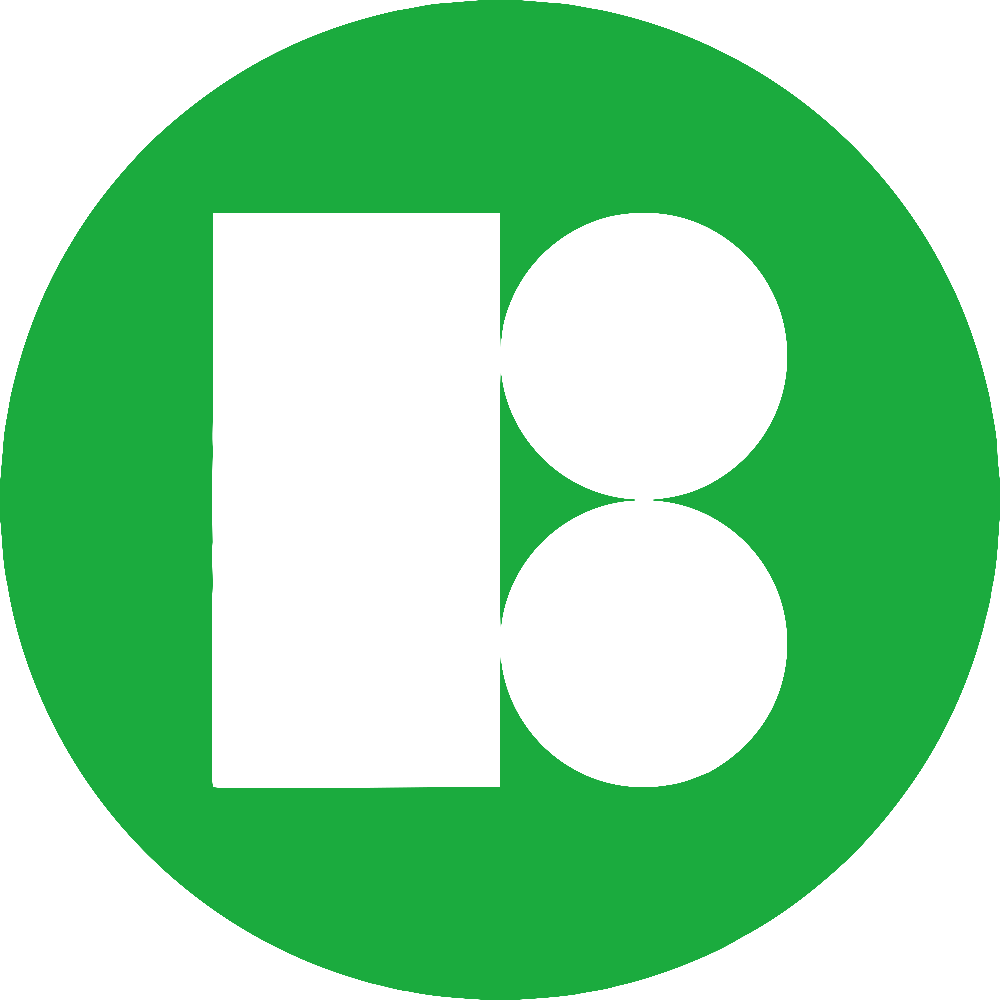

<h2> About </h2>

- Experienced in mobile application development for IoT devices compliance 
with Bluetooth Low Energy (BLE) standard. 
- Mainly develops native application using Android Studio and Kotlin. 
- Passionate in exploring the latest tech stacks in the Android development scene.

<h2> Languages and Tools </h2>

| Languages                      | IDEs / Platforms                                                     | Libraries / Tools                                                                                                                                              |
|--------------------------------|----------------------------------------------------------------------|----------------------------------------------------------------------------------------------------------------------------------------------------------------|
| ![icon][1]![icon][2]![icon][3] | ![icon][4]&nbsp;![icon][5]&nbsp;![icon][6]&nbsp;![icon][7]![icon][8] | &nbsp;&nbsp;&nbsp;&nbsp; |

[1]: https://img.icons8.com/color/48/4a90e2/kotlin
[2]: https://img.icons8.com/color/48/4a90e2/javascript
[3]: https://img.icons8.com/color/48/4a90e2/java-coffee-cup-logo--v1.png

[4]: https://img.icons8.com/color/48/4a90e2/android-studio
[5]: https://img.icons8.com/color/48/4a90e2/intellij-idea
[6]: https://img.icons8.com/color/48/4a90e2/visual-studio-code-2019.png
[7]: https://img.icons8.com/color/48/google-firebase-console.png
[8]: https://img.icons8.com/color/48/cloud-function.png

<!--
- Languages

&nbsp;

- IDEs / Platforms

&nbsp;

- Libraries / Tools

&nbsp;

-->

<h2> Projects </h2>

&nbsp; &nbsp;

<h2> GitHub Stats </h2>

<h2> Resources </h2>

- Icons

&nbsp;

<!--
**es-jliew/es-jliew** is a ✨ _special_ ✨ repository because its `README.md` (this file) appears on your GitHub profile.

Here are some ideas to get you started:

- 🔭 I’m currently working on ...
- 🌱 I’m currently learning ...
- 👯 I’m looking to collaborate on ...
- 🤔 I’m looking for help with ...
- 💬 Ask me about ...
- 📫 How to reach me: ...
- 😄 Pronouns: ...
- ⚡ Fun fact: ...
- 👋
-->
